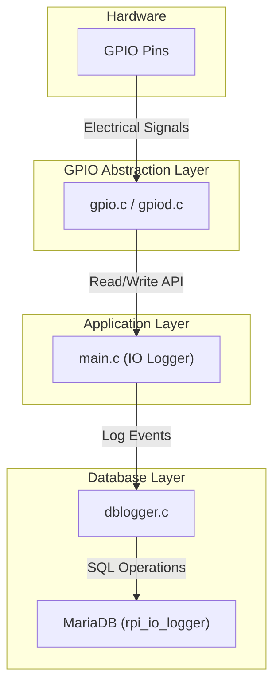
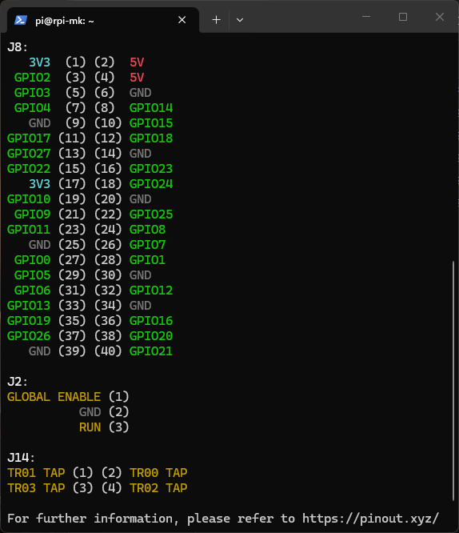
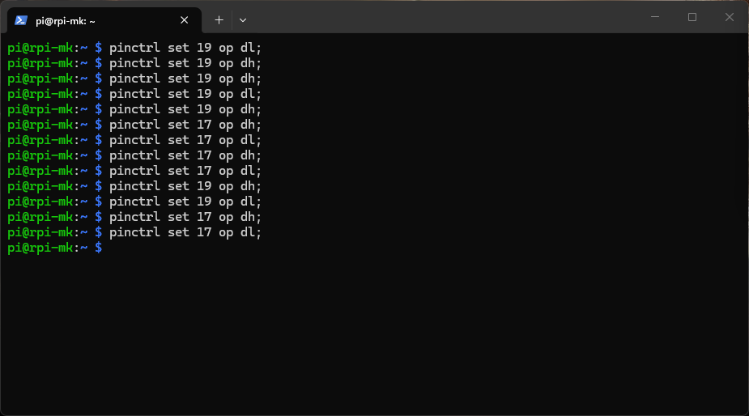
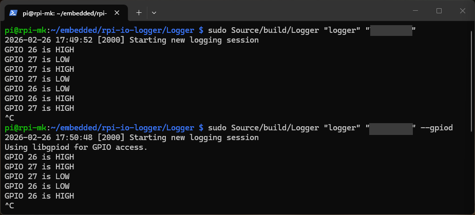
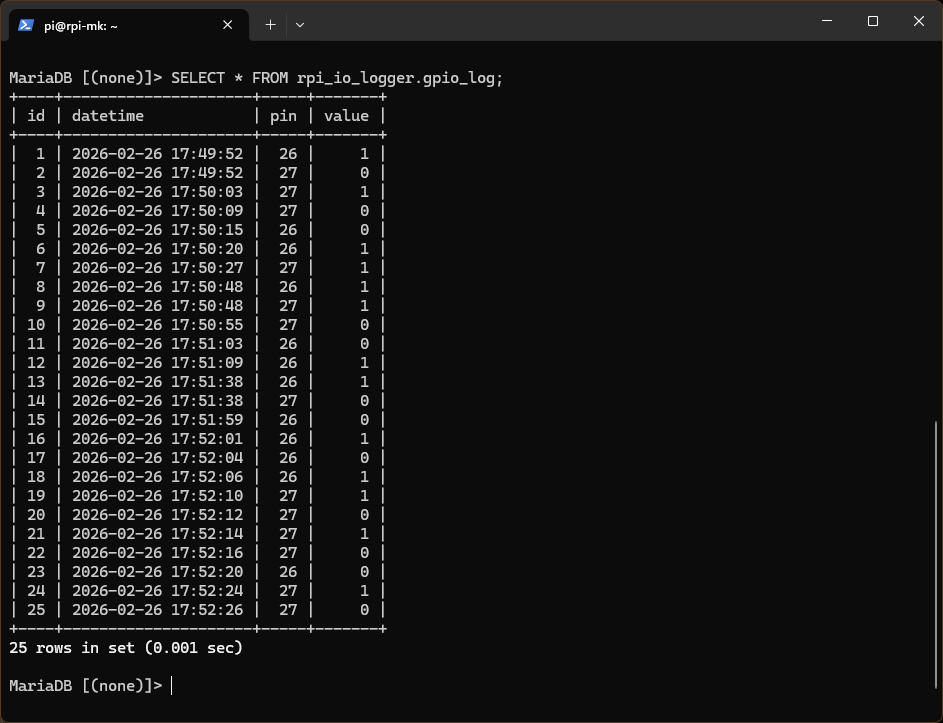
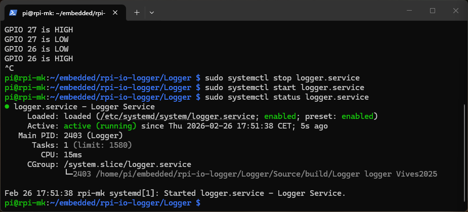
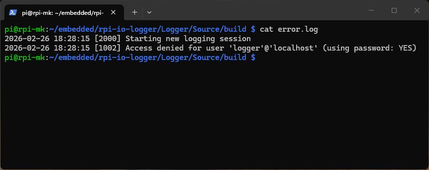

# Raspberry Pi IO Logger

## Features

- **GPIO Monitoring**: Monitors GPIO pins and logs changes.
- **Database Logging**: Stores events in MariaDB with timestamps.
- **Error Handling**: Logs errors to `error.log` for troubleshooting.
- **Daemonized Service**: Runs as a background service with systemd.
- **GPIOD Option**: Supports efficient GPIO control via GPIOD.

## Technologies

- **PJ's GPIO Library**: Custom C library for low-level GPIO access on Raspberry Pi.
- **GPIOD Library**: Modern C library for Linux GPIO control via character device.
- **MariaDB**: Open-source database for storing GPIO event logs.
- **CMake**: Cross-platform build system for compiling the application.
- **Systemd**: Linux service manager to run the logger as a background service.
- **pinctrl**: CLI tool for configuring and reading GPIO pin states.

## Architecture



## Requirements

### Install PJ's GPIO library

```bash
cd PJ_RPI
mkdir build
cd build
cmake ..
make
sudo make install
```

Github repos: [PJ_RPI](https://github.com/Pieter-Jan/PJ_RPI)

### Install MariaDB

```bash
sudo apt update
sudo apt install -y mariadb-server mariadb-client libmariadb-dev
sudo systemctl start mariadb
sudo mysql_secure_installation
```

### Install GPIOD Library

```bash
sudo apt update
sudo apt install -y libgpiod-dev gpiod
gpiodetect # list GPIO chips
gpioinfo # list GPIO lines and their status
```

## Synopsis

```sh
rpi-io-logger <username> <password> [--gpiod]
```

- `<username>`: MariaDB username
- `<password>`: MariaDB password
- `--gpiod`: *(optional)* Use the GPIOD library for GPIO access

## Usage

`GPIO 19` is connected to `GPIO 26` with a 1 kΩ resistor, and `GPIO 17` is also connected to `GPIO 27` with a 1 kΩ resistor.



`GPIO 19` and `GPIO 17` are configured as **outputs**, while `GPIO 26` and `GPIO 27` are configured as **inputs**. The logger will **monitor** the state of the input pins (`GPIO 26` and `GPIO 27`) and **log** any changes to the database, along with a timestamp.

### GPIO Pin Control

You can use the `pinctrl` command-line tool to set the pin modes.
```bash
pinctrl set 26 ip # input
pinctrl set 27 ip # input
pinctrl set 19 op # output
pinctrl set 17 op # output
```

To read the state of the pins, you can use:
```bash
pinctrl get 19,26
pinctrl get 17,27
```

To set the output pins to a high state, you can use:
```bash
pinctrl set 19 op dh;
pinctrl set 17 op dh;
```



### Build the logger

`CMakeLists.txt`:
```txt
cmake_minimum_required(VERSION 2.8 FATAL_ERROR)
project(Logger)

add_executable(Logger main.c gpio.c gpiod.c dblogger.c)

target_link_libraries(Logger PJ_RPI mariadb gpiod)
```

The application is built using **CMake**:
```bash
cd Logger/Source
mkdir build
cd build
cmake ..
make
```

### Database privileges

Grant database privileges to the logger user by replacing [USER] and [PASSWORD] with your chosen credentials.
```sql
CREATE USER '[USER]'@'localhost' IDENTIFIED BY '[PASSWORD]';
GRANT ALL PRIVILEGES ON rpi_io_logger.* TO '[USER]'@'localhost';
FLUSH PRIVILEGES;
```

### Run the logger

Run the Logger application with the database credentials as command-line arguments (and root privileges to access GPIO pins):
```bash
sudo ./Logger "[USERNAME]" "[PASSWORD]"
```



### View the logged data

You can view the logged data in the `logs` table of the `rpi_io_logger` database using a MySQL client:
```sql
SELECT * FROM rpi_io_logger.gpio_log;
```



To reset the log data, you can drop the database (and then rerun the logger to recreate it):
```sql
DROP DATABASE rpi_io_logger;
```

Or you can truncate the log table:
```sql
TRUNCATE TABLE rpi_io_logger.gpio_log;
```

### Daemonize the logger

Install the service:
```bash
sudo cp Logger/Source/config/logger.service /etc/systemd/system/
cat /etc/systemd/system/logger.service # check the content
sudo systemctl daemon-reload
```

Enable/disable the service at boot:
```bash
sudo systemctl enable logger.service
sudo systemctl disable logger.service

```

Start/stop the service:
```bash
sudo systemctl start logger.service
sudo systemctl status logger.service
sudo systemctl stop logger.service
```



### Error Logging

The logger also implements error logging to a file named `error.log` in the <u>same directory as the executable</u>. If any errors occur during execution (e.g., database connection issues, GPIO access errors), they will be logged to this file with a timestamp, an error code and a descriptive message. This allows for easier troubleshooting and monitoring of the logger's operation.



